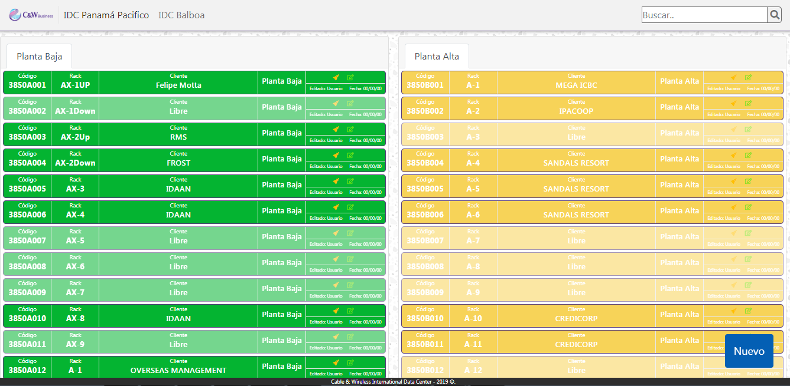
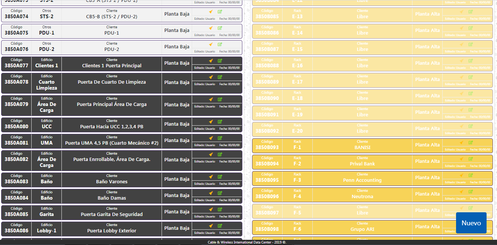
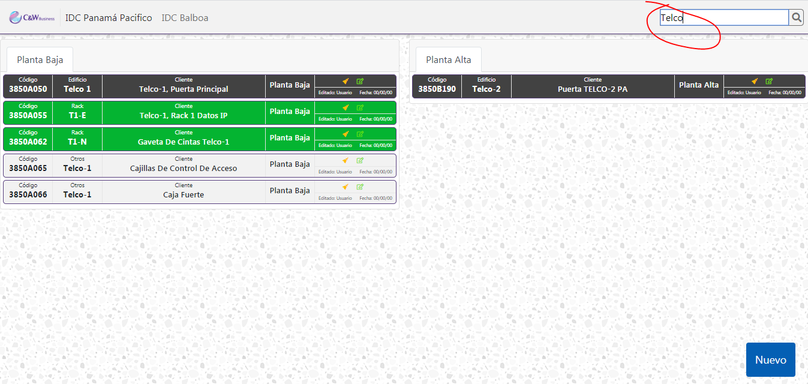
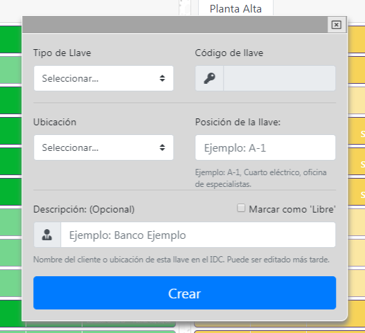

### Features

- Base de datos de llaves para gabinetes, puertas, racks, librerias,equipos de telecomunicaciones, equipos elécrtricos, equipos mecánicos y otros. (Aplicación personalizada para los Centros de Datos CWP);
-   Permite encontrar el código y posición de las llaves rápidamente mediante la funcionalidad de busqueda que incluye la aplicación;
- Desarrollada con NodeJS : Aplicación desarrollada en NodeJS, tanto en el backend, como en el frontend. @NodeJS, @EJS, @JQuery;
  - Utiliza @EJS como motor de vistas junto con @JQuery;
- La aplicación brinda funcionalidades de busqueda:
  - Busqueda por código de llave.;
  - Busqueda por tipo de llave: (**rack**, **jaula**, **edificio**, **otros**);
  - Busqueda por posición de la llave (piso, o planta a la que pertenece la llave);
  - Busqueda por nombre de cliente, o dueño de la llave;
- Base de datos @MongoDB;

# PORTAL DE LLAVES IDC
## Imágenes
**Dashboard principal**

 
_______
**Función de busqueda**
Busqueda rápida indexada. filtra las llaves según los caracteres introducidos en el campo de busqueda.

_______
**Añadir nuevas llaves**
Permite agregar nuevas llaves, asignando un código único a las mismas.

